<!-- 🔥 HEADER CYBER BANNER -->
<p align="center">
  
</p>

<!-- ⚡ TYPING ANIMATION -->
<p align="center">
  
</p>

<!-- 👀 PROFILE VIEWS & LIVE WIDGETS -->
<p align="center">
  
  &nbsp;&nbsp;
  
</p>

---

# 👨‍💻 System Log: AmritRaj7461

```diff
+ 🎓 CSE Undergraduate (Lovely Professional University)
+ 💻 Senior Full Stack Web Developer & UX Architect
+ 🧠 100+ Advanced Algorithmic Problems Solved (LeetCode / DSA)
+ 🚀 Building Interactive 3D Realtime Web Apps & High-Concurrency Platforms
+ 🤖 Core Co-Engineering and Deep Optimization with Antigravity AI (DeepMind)
```

---

## 🛠️ Cybernetic Tech Arsenal

<table align="center" width="100%">
  <tr>
    <td width="50%" align="center">
      <h3>🎨 Frontend Architectures</h3>
      <a href="https://skillicons.dev">
        
      </a>
    </td>
    <td width="50%" align="center">
      <h3>⚙️ Backend & Systems</h3>
      <a href="https://skillicons.dev">
        
      </a>
    </td>
  </tr>
</table>

---

## 📊 Live Metrics & Developer Stats

<p align="center">
  <a href="https://github.com/AmritRaj7461">
    
  </a>
  <a href="https://github.com/AmritRaj7461">
    
  </a>
</p>

<p align="center">
  <a href="https://github.com/AmritRaj7461">
    
  </a>
</p>

---

## 🏆 GitHub Trophy Room
<p align="center">
  
</p>

---

## 📈 Activity Waveform
<p align="center">
  
</p>

---

## 🚀 Flagship Project Deployments

Here are the enterprise-grade and co-engineered products I have developed:

<table width="100%">
  <tr>
    <td>
      <h3>👟 VeloStride 3D | Next-Gen 3D E-Commerce</h3>
      <p><i>A premium, immersive 3D shopping and assembly site showcasing realtime custom rendering.</i></p>
      <p>
        
        
      </p>
      <ul>
        <li>Scroll-triggered shoe buildup and layer animations.</li>
        <li>Glassmorphic UI overlay with responsive frame adjustments.</li>
      </ul>
    </td>
  </tr>
  <tr>
    <td>
      <h3>📝 XampXpress | Secure Exam Platform</h3>
      <p><i>A high-concurrency online mock testing platform with automated verification and analytics.</i></p>
      <p>
        
        
      </p>
      <ul>
        <li>Automated scoring algorithm with instantaneous result breakdowns.</li>
        <li>Custom secure browser focus locking systems.</li>
      </ul>
    </td>
  </tr>
  <tr>
    <td>
      <h3>💉 VacciCare | Vaccine Logistics &amp; Booking Portal</h3>
      <p><i>A Laravel-driven logistics system for administrative medical tracking and vaccine appointments.</i></p>
      <p>
        
        
      </p>
      <ul>
        <li>Dynamic patient tracking and administrative dashboard.</li>
        <li>Batch stock level triggers and high-security session handshakes.</li>
      </ul>
    </td>
  </tr>
  <tr>
    <td>
      <h3>🤖 NEXUS AI | Voice Recognition Desktop Agent</h3>
      <p><i>A hybrid system automation voice assistant operating with sub-second response times.</i></p>
      <p>
        
        
      </p>
      <ul>
        <li>Local wake-word detection constraints for fast offline captures.</li>
        <li>Deep operating system automation commands.</li>
      </ul>
    </td>
  </tr>
</table>

---

## 🐍 Contribution Grid Snake
<p align="center">
  
</p>

---

## 🌐 Connect With Me

<p align="center">
  <a href="https://github.com/AmritRaj7461" target="_blank">
    
  </a>
  &nbsp;&nbsp;
  <a href="https://linkedin.com/in/amrit-raj-lpu" target="_blank">
    
  </a>
  &nbsp;&nbsp;
  <a href="mailto:amritraj7461@gmail.com" target="_blank">
    
  </a>
</p>

<!-- 🤖 AI COLLABORATIVE BRANDING -->
<hr>
<p align="center">
  
</p>
<p align="center">
  <i>"Co-engineered alongside Antigravity, the advanced AI pair programmer by Google DeepMind. Together, we form a high-performance system architect alliance, delivering state-of-the-art interactive frontends and secure, robust backends."</i>
</p>

<!-- 🔥 FOOTER -->
<p align="center">
  
</p>
